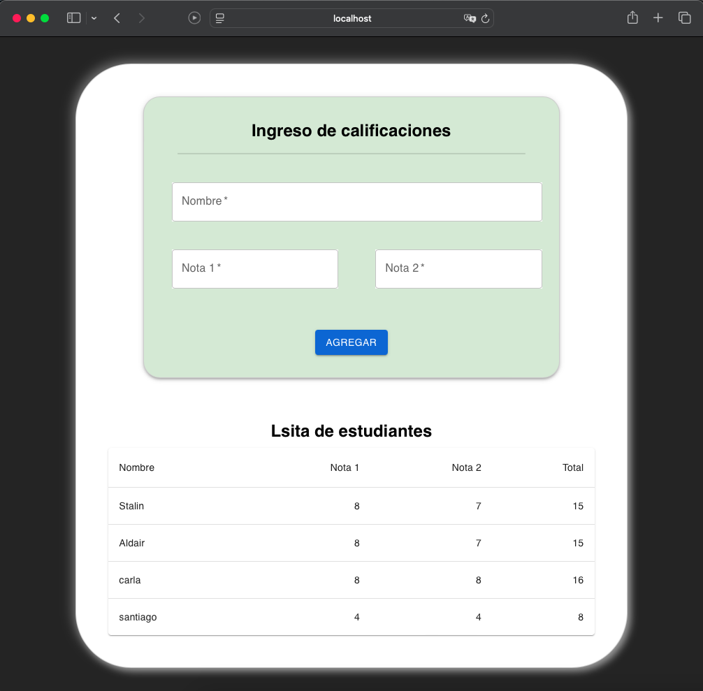

# Gestión de Estudiantes - Taller Aplicaciones Web y Móviles

Este proyecto es la resolución de un taller de la materia **Aplicaciones Web y Móviles** del semestre **2024B**. El programa permite agregar estudiantes junto con dos notas, calcular la suma de estas, y almacenarlas en una base de datos utilizando **JSON Server** y **Axios**.

## Características
- Formulario para ingresar el nombre de un estudiante y sus dos notas.
- Cálculo automático de la suma de las notas.
- Almacenamiento de los datos en un servidor local con **JSON Server**.
- Visualización dinámica de los estudiantes registrados en una tabla.

## Tecnologías Utilizadas
- **React.js**: para la creación de la interfaz de usuario.
- **Vite**: como herramienta para desarrollar y compilar la aplicación.
- **Material UI**: para un diseño moderno y responsivo.
- **Axios**: para la comunicación con el servidor.
- **JSON Server**: como base de datos local simulada.

## Requisitos Previos
1. Tener **Node.js** instalado.
2. Tener instalado **npm** (incluido con Node.js).

## Cómo Usar
1. **Instalar Dependencias**:  
   Asegúrate de instalar las dependencias del proyecto ejecutando:
   ```bash
   npm install
   npx json-server db.json
   npm run dev (este ultimo debido a que se usa vit para levantar el servidor react)

---

### **DEMO**  
 